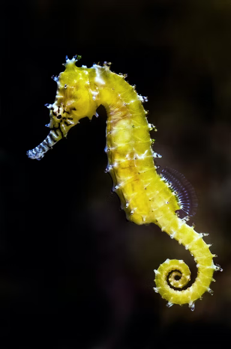

_From unravelling seahorses' secret sounds to safeguarding the habitat of these little super dads._

Stealthy daddy seahorses generally give birth under the cover of nightfall to reduce the chances of their newborns being eaten by beady-eyed predators. How does a daddy seahorse come to give birth? Well just to clear things up, seahorses aren’t hermaphrodites nor do they have sex changes, as multiple other species of fish do.

It starts with a wanna-be daddy seahorse. He will parade around showing his empty pouch to prospective females. An eager female who thinks he will make good father material will swim up to him and they will waltz around together in the water column until she transfers her eggs into his pouch. As the eggs are being transferred into his pouch he will fertilize them, Dr Adam Lim -who is now more widely known as Dr Seahorse -explains. The eggs will embed into the pouch of the daddy seahorse's tissue lining. Here each egg will develop into a teeny-tiny seahorse with eyes that move independently like a chameleon, a straw-like mouth, a pouch like a kangaroo, and a prehensile tail like a monkey.

**Captivating creatures inspire**

These charismatic underwater creatures captured the curiosity of Dr Adam Lim when he was just an undergrad student volunteering for Save Our Seahorses Malaysia. From being a volunteer he went on to research how seahorses communicate with the organisation and discovered they communicate using sounds! He now heads up Save Our Seahorses Malaysia, where he first volunteered to help find seahorses over a decade ago. The organisation harnesses the charismatic nature of seahorses using them as a flagship species to conserve marine habitats.

**A slow start**

Lim started off as a volunteer with Save Our Seahorses Malaysia back in 2007. He had still never seen a single seahorse after his first two survey trips with the organisation but the enduring undergrad student signed up for a third trip and was rewarded! On that third trip, he waded amongst the waving seagrass and spotted not one but two seahorses. What’s more, they were whirling and waltzing around in the water column together in a courtship display! Their delicate dance sparked his curiosity about the little creatures and how they communicate.

**How do seahorses communicate with each other?**

The question of how seahorses communicate compelled Lim to take up an undergraduate research project on the matter with Save Our Seahorses Malaysia’s founder, Choo Chee Kuang. Lim explored more about seahorse communication and discovered that seahorses make sounds! What do seahorses sound like? Seahorses produce clicks when feeding and growls when they are distressed, they can even purr, Lim explains. He tells me scientists are still unsure of the significance of the growl but think that it might be to startle predators. Lim’s discovery that seahorses were not silent creatures only ignited his curiosity further and he went on to pursue his PhD focusing on the sounds seahorses produce. He discovered that each species produced different sounds and that individual seahorses produced specific unique patterns of sounds.

**An uncertain future for seahorses**

These articulate little creatures are threatened by harvesting and habitat destruction but Save Our Seahorses Malaysia, which Lim now heads up, is doing all it can to fully understand and mitigate the threats. Seahorses only survive in specific habitat types, for most species that habitat type is seagrass beds and mangroves while a few species are adapted to inhabit coral reefs. Lim explains that Save Our Seahorses Malaysia has successfully lobbied for developments that would have destroyed seahorse seagrass habitats to redraw their plans to avoid total destruction of the delicate seahorse habitat.

Save Our Seahorses Malaysia’s project “Tracing our seahorses,” is gathering information about how seahorses are harvested and what they are used for. The project is engaging with individuals that use seahorses, including traditional healers, as well as those who fish for seahorses. They are doing this in order to be able to better address and manage the harvesting of seahorses. The project has been hugely successful in finding out what seahorses that are harvested in Malaysia are used for. Seahorses are widely used in indigenous Malaysian traditional medicine as opposed to Chinese traditional medicine as originally thought. Now Save Our Seahorses Malaysia can focus its efforts on educating Malaysian as opposed to Chinese traditional healers. Save Our Seahorses Malaysia is doing a phenomenal job of conserving seahorses and marine habitats from threats.

**Wildcards welcome Save Our Seahorses Malaysia**

Save Our Seahorses Malaysia has partnered with Wildcards, a tech startup that sells NFTs to raise funds for conservation. Wildcards have launched an NFT wildcard of [Wei Wei](https://wildcards.world/#explorer/details/68) a Spotted Seahorse Save Our Seahorses Malaysia helps protect. The funds generated by this card will flow to Save Our Seahorses Malaysia so they can keep up their impactful work conserving seahorse and marine habitats in Malaysia.

Check out Wildcards website: [https://wildcards.world](https://wildcards.world/#)

Follow Wildcards on Instagram: [@wildcards_world](https://www.instagram.com/wildcards_world/)

Follow Wildcards on Twitter: [@wildcards_world](https://twitter.com/wildcards_world)

Follow Wildcards on Facebook: [@wildcards.conservation](https://www.facebook.com/wildcards.conservation)

Join Wildcards on: [Discord](https://discord.gg/2BKqdhPzEv)
