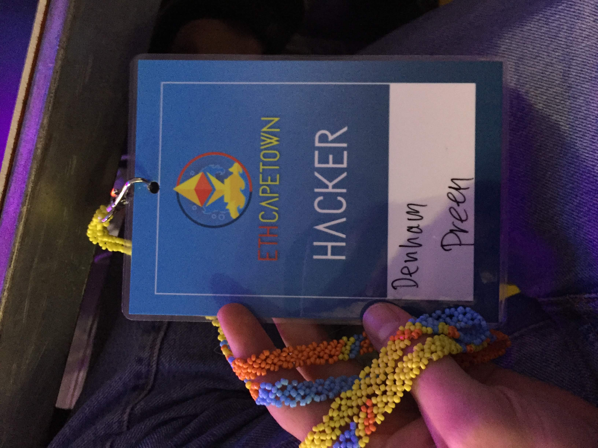
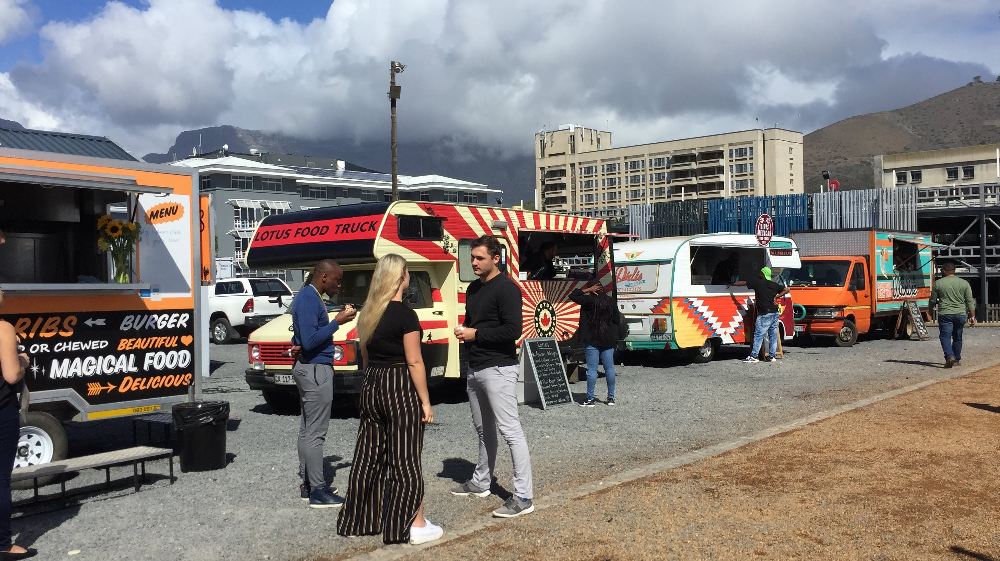
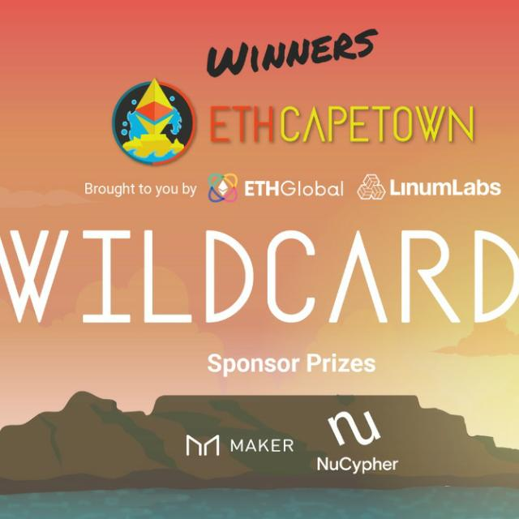

# What it's like to attend a hackathon like EthCapeTown

Armed to the teeth with brains and Jon Jon, the wildcards team attended [EthCapeTown](https://ethcapetown.com). Of course, at this point, we were merely good friends from University. Unknowingly about to fall upon a revolutionary conservation funding model. A self-regulated open market place leveraging Harberger Tax and incentives to create a new conservation patronage asset class. [Wildcards](https://wildcards.world).

The team, 4 developers strong, passionate about our planet, embarked on 48 hours of non-stop hacking. 9 hours in, at 3 am on Saturday morning, we weren't a line of code in. Still in debate on what we were buidling. On the fence between a crowdfunding student education app and a gambling app with a simple but difficult to implement mechanic. The team retreated to our closest home and had a deep sleep on slightly too short couches.

9 am sharp! we were outside the most luxury line of Cape Town's finest food trucks. EthCapeTown spoiling its hackers with an all you can eat buffet of food trucks. We eat our burritos, boerie rolls and sushi on the balcony looking over the crystal clear icy cold waters of the Atlantic ocean while table mountain sits pretty behind us.

We start coding, stop coding, scrap that code. 3 pm we starting thinking about conservation tokens, precisely somewhere around 2 minutes later, Jon Jon comes up with the idea to marry conservation tokens and always for sale. Inspired by Simon de la Rouviere's [This Artwork is Always on Sale](https://thisartworkisalwaysonsale.com/) and Glen Weyl and Eric Posner's [Radical Markets](http://radicalmarkets.com/). We've got it!

We start coding again. Renewed energy, we have this! We help ourselves to more free food and refreshments, organic energy drinks and kombucha. We code, we think, we talk, we get mentored by the network of incredible mentors and we code some more. Around midnight we are treated to [authentic crêpes](https://www.facebook.com/larozell/). The team is squinting into our computers by 4:30 am. There are still 50 or so, out of the 190 hackers suited in hoodies and headphones hacking around us, some sleeping at the table. We retreat to one of the previous talk venues to where mattresses have been laid out. We cross Andy Tudhope, one of EthCapeTown's Judges from [Status](https://status.im/), reading his book. We "team sleep" for 2 hours and wake up back to our computers where the sun is rising through the glass ocean-facing wall.

At some point, Vitalik nonchalantly arrives and sits at one of the desks at his Thinkpad. EthCapeTown is waking up again and the food trucks open their flaps. We are frantically coding trying to build a working product. We deploy to the testnet, we spruce up the front end and with 3min to go, we make a video demo to explain what we built. We are finished, physically too, the hacking is over, its time for presentations.

We watch the other awesome projects present through fuzzy brains. We then present ourselves. Exhausted, we treat ourselves to a beer and get ready for the after-party at The Grand. We are super proud to have been winners and thankful to [EthGlobal](https://ethglobal.co/), [Linum Labs](https://linumlabs.com/) and [NuCypher](https://www.nucypher.com/) for getting the chance to partake in such an awesome event and prizes.

Check out the video demo below of all the winners of EthCapeTown and their projects.

`youtube:https://youtube.com/embed/YTso8-cqSN8?t=226`

Visit our website [Wildcards](https://wildcards.world) where you can go ahead, buy a wildcard, and start contributing toward at risk animal conservation.

Follow our socials to learn more about our project and the conservation causes we are working towards.

Follow us on Instagram: [@wildcards_world](https://www.instagram.com/wildcards_world)

Follow us on Twitter: [@wildcards_world](https://twitter.com/wildcards_world)

Follow us on Facebook: [@wildcards.conservation](https://www.facebook.com/wildcards.conservation)

Join us on [Discord](https://discord.gg/Wemmn63)
