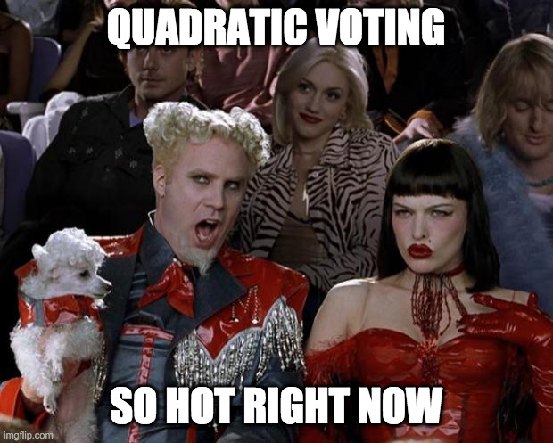
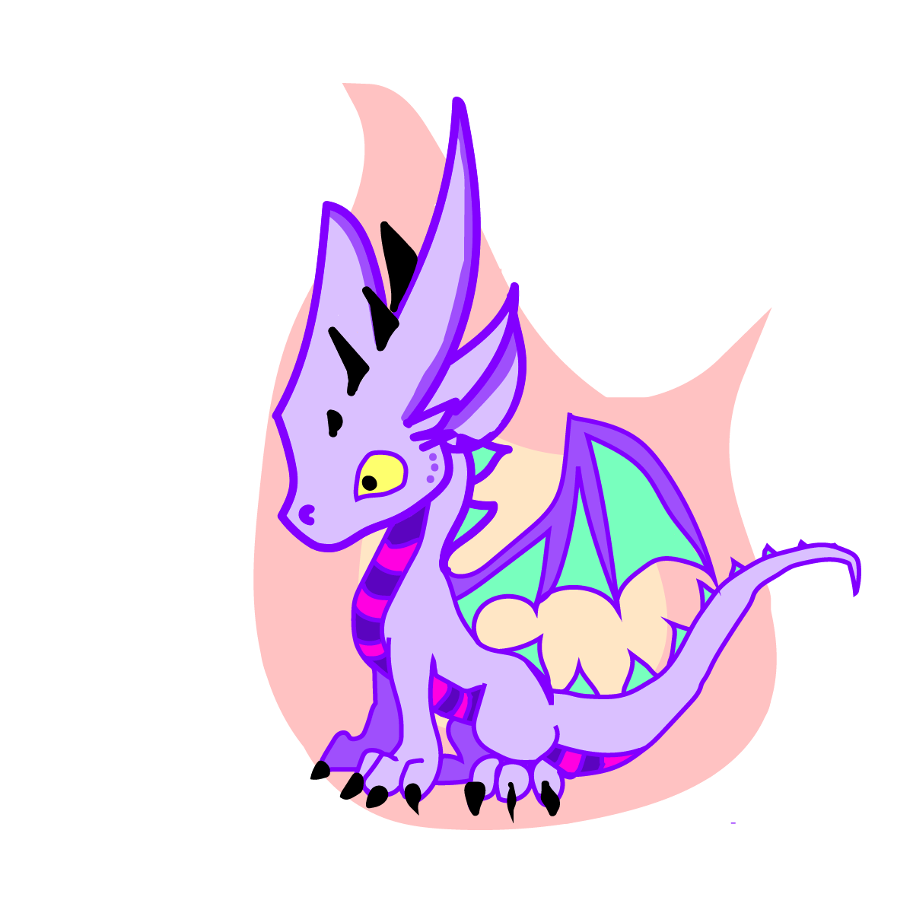

TLDR; We are launching a new wildcard (Glen the Dragon) in the next 48 hours! Funds raised by [Glen the dragon](https://wildcards.world/#details/Glen) will go to a conservation as voted by the wildcards community [on-chain quadratic voting].

Hackathons are really fun events. It feels a bit like you are given a blank canvas. No rules. No limitations. Just try to think of the coolest and craziest possible ideas, get together some friends, and build them!

Berlin, Bangalore, Cape Town, London and Paris are some of the epic destinations we've (our team wildcards) hacked at so far. I'll never forget brainstorming till 3am in India's most dodgy hostel. Jason Smythe was so excited about our idea he was regularly throwing in legit dance moves during the conversation.

The next stop was going to be Turin, Italy for the exciting ETHTurin. Obviously, Italy in the flesh right now, was not exactly an option #COVID19. Fortunately, this didn't stop us or the organizers, as it became an awesome virtual affair.

About a year ago, we built wildcards, a platform connecting animal conversations to environmentalists, through a social and gamified experience. For this hackathon, we were brainstorming ways that we could allow our users to govern wildcards as much as possible.

Thought number one: Since we raise funds conservation, why not let the users who contribute funds vote for which conservation the funds should be directed towards?

Thought number two: Why not use the trendy Quadratic Voting as our governance mechanism?

If you are lost, do not fear. I'm going to break everything down step by step.

So wait, first off, how are the funds for the conservation generated?
Wildcards are effectively digital animals that have a guardian. The guardians of wildcards pay a self assessed fee to the conservation in order to hold the title of guardian. The super interesting always for sale price discovery mechanism is something you can read about more here when you get the

Who is Glen the Dragon?
Glen the Dragon.Glen the dragon of Turin emerged from the Alps just North of the city. Head over here to learn more about his magical origin. 
Glen is a wildcard, where all the funds raised by Glen the dragon, will go to a conservation as voted by the wildcards community.

Hold up, Quadratic voting?
In its most basic form, the power of a vote, is the square root of its size. I.e. a vote of size 9 will have a power of 3, a vote of size 100 will only have a power 10 etc. The desired result is that users with large amounts of voting power cannot radically swing the result toward one specific candidate. 
The idea of Quadratic voting is explored extensively in the book, Radical Economics, and therefore named after one author Glen Weyl.

Who gets to vote?
Anyone who is the guardian of a wildcard, is rewarded with 1 wildcard loyalty token per day. The guardian can then use these loyalty tokens to vote for the conservation that they believe should receive the funds raised from Glen the Dragon. The vote will happen on a monthly basis.

That's it! We are super stoked that we managed to nab 3rd place at the ETHTurin hackathon. Thanks to Denham Preen, Jason Smythe and Andrew Stanger for being such cool teammates. 
It's time to grab a wildcard and start voting on where you want to see the money go!

Follow our socials to learn more about our project and the conservation causes we are working towards.

Follow us on twitter: [@wildcards_world](https://twitter.com/wildcards_world)

Follow us on Facebook: [@wildcardscrypto](https://www.facebook.com/wildcardscrypto)

Join us on Telegram: [Telegram](https://t.me/wildcardsworld)
