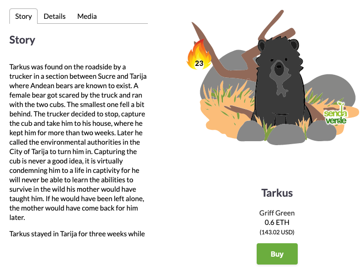

We’re excited today to be talking about one of our first and favourite conservation partners, La Senda Verde!

La Senda Verde has spent the last 15 years fighting the illegal wildlife trade in Bolivia, helping to rehabilitate the animals rescued from this cruel trade.

`youtube:https://www.youtube.com/embed/W3s2rwVlKSE`

## La Senda Verde Partnership

The partnership will see more funds being raised for La Senda Verde’s conservation efforts through the wildcards platform.

Tarkus the bear is one of the many animals being cared for at La Senda Verde. You can become the guardian of [him](https://wildcards.world/#explorer/details/15) today and start supporting La Senda Verde’s amazing conservation efforts.

## About Wildcards

Wildcards is a fun and engaging platform raising funds for animal conservations around the globe. Users can become the guardian of various cool animals, earn badges and rewards, rank on leaderboards, and help support conservation on a global scale. The platform also educates the public about the vast number of conservations working worldwide to ensure that the precious animals we have today will flourish tomorrow.

Follow us on Instagram: [@wildcards_world](https://www.instagram.com/wildcards_world)

Follow us on Twitter: [@wildcards_world](https://twitter.com/wildcards_world)

Follow us on Facebook: [@wildcards.conservation](https://www.facebook.com/wildcards.conservation)

Join us on [Discord](https://discord.gg/Wemmn63)

As always, stay cool, stay safe and stay tuned

Team Wildcards
