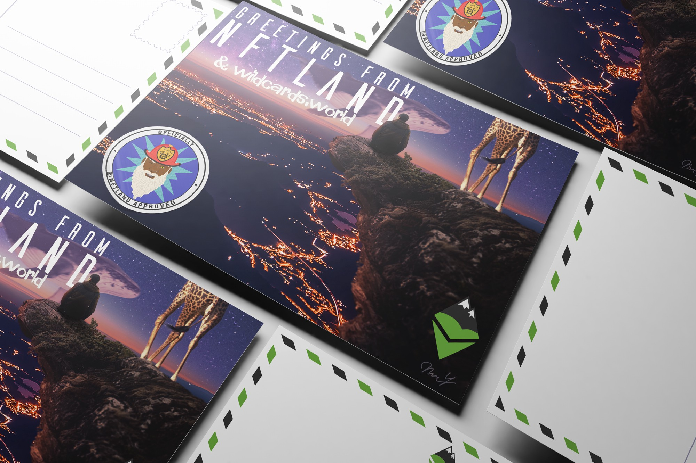

# NFT Postcards for a purpose

A limited edition set of NFTs has been created in partnership with the TokenSmart community to support wildlife, and it is an exciting opportunity for you to get involved.

There are exactly 111 NFTs, and each of them is redeemable for a specially designed postcard that will be delivered to you. Three lucky winners will receive a split of 1.5 ETH and a surprise wildcard.

Participation costs 0.1 ETH — with 60% of that going directly to wildlife conservation (the rest is for covering costs for the TokenSmart team and prizes). All of these funds due for wildcards will go into the wildcards DAO and be distributed to our most deserving partners.

You can purchase these NFTs [on Rarible](https://rarible.com/token/0xd07dc4262bcdbf85190c01c996b4c06a461d2430:381426:0xa898ac24f567715b1e023dcb7a98961f7d6fa918).

## What is a ‘Wildcard’?

A wildcard is an NFT that raises funds for our partner organisations, continuously. Each wildcard has a captivating, fact-filled story about an individual animal, that our conservation partner is researching, and aims to protect and help better manage. You’ll be able to buy one of these Wildcards online, which will make you the guardian of that Wildcard animal. When you buy a Wildcard, you must set the price you are willing to sell it for. Every month, as the guardian of a Wildcard, you will give a specified portion (typically 20% per month) of the selling price you set, to that animal’s representative conservation agency. At any point, someone can buy the Wildcard from you, at the selling price you specified. When someone buys the Wildcard from you, they must set a selling price. The new guardian of the Wildcard is then responsible for giving the new monthly subscription. And so the cycle continues, to generate funds.

Also read: [Wildcards: an unprecedented means of funding conservation](https://blog.wildcards.world/wildcards-intro/)

Follow Wildcards on Twitter:[ @wildcards_world](https://twitter.com/wildcards_world)

Follow us on Instagram: [@wildcards_world](https://www.instagram.com/wildcards_world)

Follow Wildcards on Facebook: [@wildcards.conservation](https://www.facebook.com/wildcards.conservation)

Join us on Discord: [Discord](https://discord.com/invite/2BKqdhPzEv)
