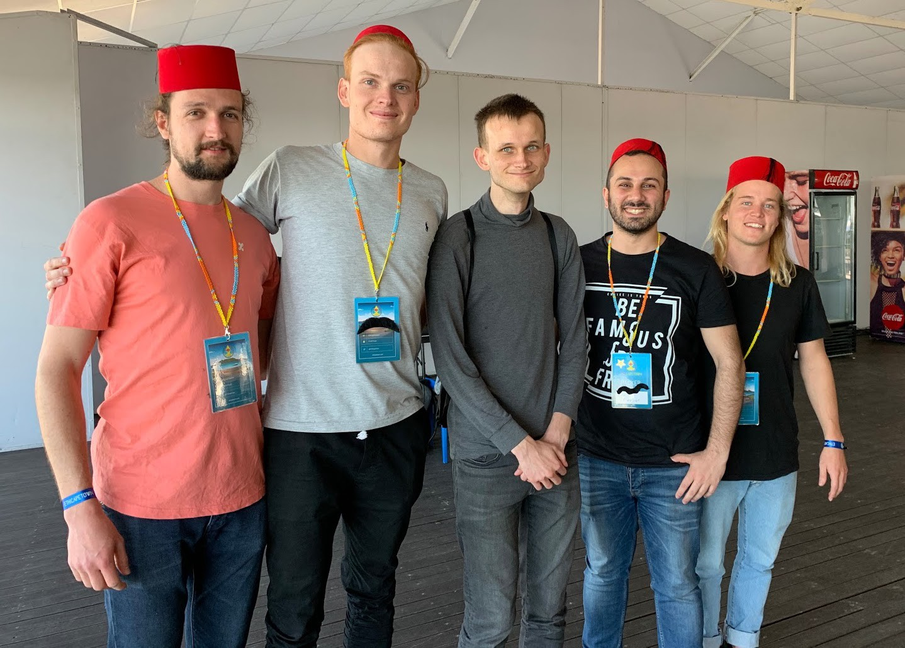

Welcome to the world of wildcards! What on earth is wildcards?!

> It’s a project started by friends to help generate sustainable and meaningful contributions toward endangered animal conservation.

So let’s quickly go through some of the main questions you may have right now…

## How it started?

Technically, it all started in a cramped computer science honours classroom in Cape Town. This is where we all met when still studying. Alas, some years went past before we reunited at the #ETHCapeTown2019 hackathon. We were really fortunate to be winners and this motivated us to keep working on wildcards.

Team wildcards at the #ETHCapeTown2019 hackathon with Vitalik Buterin

Why stop there? Next stop #ETHIndia2019 for some more coding and team ideation. This was a super fun trip. Backpacking and coding through India sounds exactly like it is. Lots of prawn curry, late nights and git commits.

The team in India

## What are wildcards?

Wildcards are unique digital assets… See below.

Example of wildcard (Vitalik)

Every wildcard represents an endangered animal, with funds generated from this wildcard flowing toward the conservation organisation representing and protecting that animal.

Wildcards can easily be bought by anyone at anytime. Hence, we say that our wildcards are ‘always for sale’.

## How are wildcards always for sale?

This is what is actually super cool and unique about wildcards. We have leveraged an idea from a book called ‘radical markets’, that proposes a fascinating ‘always for sale mechanism’.

In a nutshell, whenever someone buys a wildcard, they are immediately required to set a selling price for that wildcard. Therefore, the wildcard can at anytime be bought for that selling price, and is ‘always for sale’. The interesting economic dynamic is that the owner of the wildcard pays a percentage based fee on the selling price they set (known as harberger tax).
If you are lost… don’t worry — we made this cool little video which should hopefully explain it a bit better :)

`youtube:https://www.youtube.com/embed/63qtVVmcpmU`

## Why are we in Paris?

Our team was selected to be part of Ubisoft Entrepreneurs lab in Station F, Paris. See below…

> As part of the Strategic Innovation Lab, the Ubisoft Entrepreneurs Lab’s mission is to team up with innovative startups to explore technologies or trends that might become critical for Ubisoft in the future. We work with each startup batch for a six-month long season, striving to create valuable collaborations between each startup and the Ubisoft Group as a whole.

## What’s next?

Shhhh… we have partnered with an amazing conservation organisation that will help distribute funds generated from this project. More details to follow soon!
More good news! We are going to release a bunch of new wildcards next week — and more and more over the coming weeks and months during our time in Paris!

## How can I get involved?

Visit our website [Wildcards](https://wildcards.world) where you can go ahead, buy a wildcard, and start contributing toward endangered animal conservation.

Follow our socials to learn more about our project and the conservation causes we are working towards.

Follow us on twitter: [@wildcards_world](https://twitter.com/wildcards_world)

Follow us on Facebook: [@wildcardscrypto](https://www.facebook.com/wildcardscrypto)

Follow us on Telegram: [Telegram](https://t.me/wildcardsworld)

Stay tuned,

Team Wildcards
