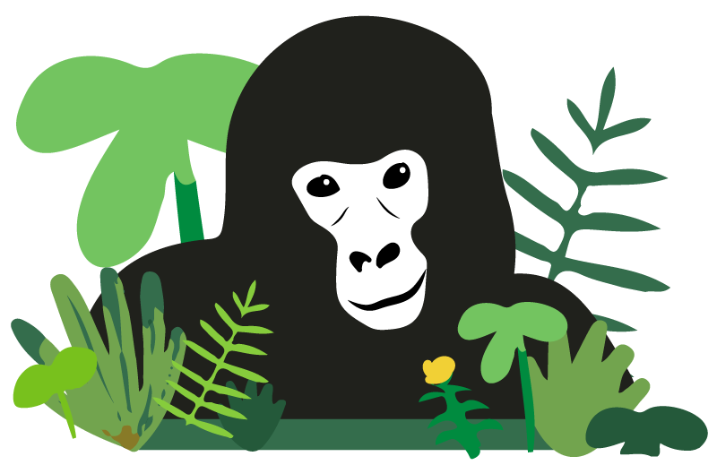
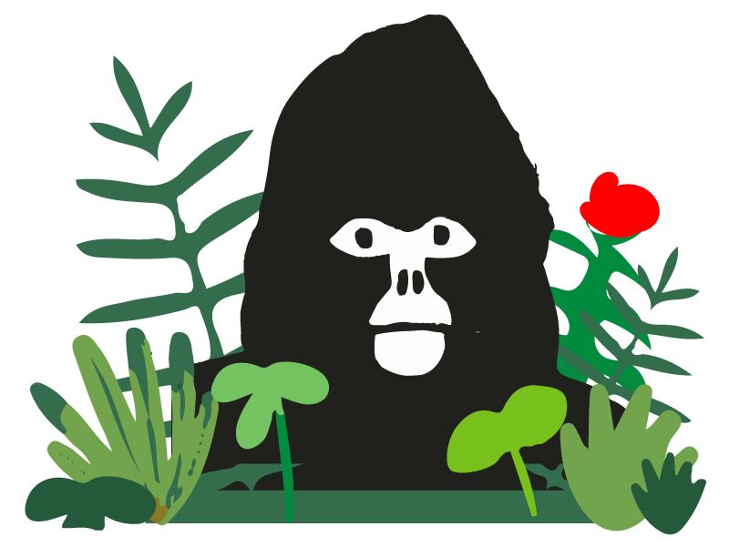
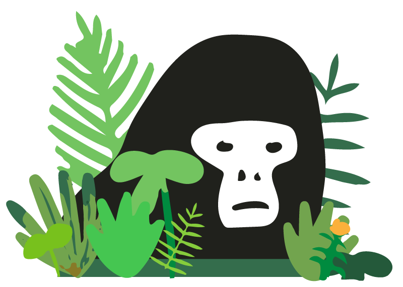

Coming up with gorilla names is hard. You have so many cool names like Max, Cass, Chewbacca, Sassy, Harambe, Darth Vader, and it very quickly becomes difficult to choose! Therefore, we decided to name the first few after some legends who personally inspired the wildcards journey. In fact, Simon, Vitalik and Andy were 3 of the judges at the ETHCapeTown hackathon we ended up winning.

## Simon

Let's start with Simon. We forked some pretty awesome code from Simon. Seriously, he was a wizard who put us on the right track. He has helped inform some of our design decisions regarding our subsequent smart contracts, and always been willing to lend some great advice or checkout a GitHub issue for us.

## Vitalik

Next, Vitalik Buterin. Believe it or not, Vitalik managed to crack a rare smile during our hackathon presentation, and that was good enough for us. Rumour has it he is stashing his eth away in anticipation to buy the newly released wildcards and save at risk animals.

## Andy

It was 4 am on Sunday, and before we collapsed on mattresses at the hackathon hall, we found Andy "CryptoWanderer" Tudhope reading some profound book. Andy encouraged us to attend ETHIndia (which turned out to be an amazing experience).

Visit our website [Wildcards](https://wildcards.world) where you can go ahead, and buy a Simon, Vitalik and Andy, and start contributing toward at risk animal conservation today!

Follow our socials to learn more about our project and the conservation causes we are working towards.

Follow us on Twitter: [@wildcards_world](https://twitter.com/wildcards_world)

Follow us on Facebook: [@wildcards.conservation](https://www.facebook.com/wildcards.conservation)

Join us on [Discord](https://discord.gg/Wemmn63)

As always, stay cool, stay safe and stay tuned

Team Wildcards
