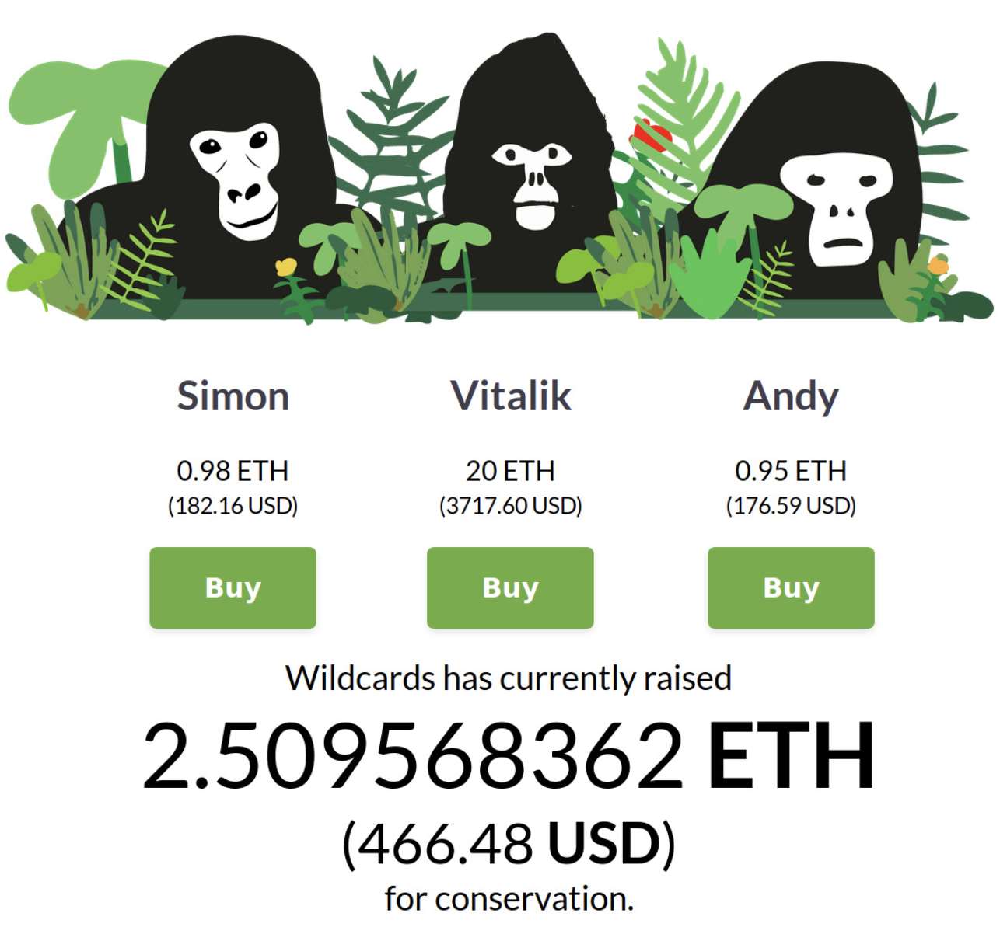

# Where is the money going?

Transparency is a beautiful feature of a blockchain and something we value highly. At the time of writing this, wildcards has raised 2.509 ETH or 469USD for conservation! We are extremely proud of this progress at wildcards HQ but it begs the question where is this money going? and what is it doing?

Where money? where?

When [Vitalik](https://wildcards.world/#details/Vitalik) (our first wildcard) crawled out of the Solidity Jungle 🦍 and came to life, wildcards had not yet partnered with a wildlife conservation. Our OG (Original Gorilla/Original Gangster), Vitalik, was born early and so the funds he raised went to a public address managed by Wildcards, in preparation of a future payment to a wildlife conservation. Subsequently, we have partnered with Wild Tomorrow Fund, a New York based, wildlife conservation organization operating in Southern Africa.

Fortunately for wildcards, through the good graces of crypto, [Wild Tomorrow Fund](https://www.wildtomorrowfund.org/) has an ethereum wallet. In fact, we have sent the first bit of funds raised to them already, cha-ching! All of it, you can follow the public transactions [here](https://etherscan.io/tx/0xe6864067a717363d27bb1aaee446c568c4be03997c38795c05aa6de2f92d49f5) and verify Wild Tomorrow Fund holds the wallet by visiting this [page](https://www.wildtomorrowfund.org/crypto-wallets) on their website.

If you want to look even further check out the transfers from wildcards Simon, Vitalik and Andy [here](https://etherscan.io/tx/0x8ca0534cca464832f53cb63e64c96e6946c7d28660b7814c946f16e4a74d5c11#internal) and [here](https://etherscan.io/tx/0x0cb3d7132c7df1f0bd3140706a8eae1e31832ddf44f17ffc8fe88543d8ddbc24#internal).

Screenshot of https://wildcards.world at the time of the transaction

## So, we've raised 2.509 ETH so far… What is it doing?

2.509 eth aka 469 USD, is a humble yet strong start. It signifies that this is actually working, and money is going to beloved animals we are trying to protect. So, let's break this number down step by step to help quantify its impact so far. 
 It is:
1 buffalo reintroduced into the wild or
2 months of a ranger's salary or
3 times 0.843 Eth or 
…
2022 bananas
One more crucial figure… it is only 0.0000006% of the [yearly amount](https://www.the-scientist.com/the-nutshell/conservation-will-cost-76-billion-40357) needed to preserve conservation! Basically, we are just getting started and have ambitious goals to drastically increase this number.

## Is team wildcards going to raise a bunch of money then flee to the Bahamas and listen to No Women No Cry while buying cocktails with bitcoin?

Obviously, this is a valid concern, we love Bob Marley. In serious terms, we recognize that the money cannot continue to flow through us toward the conservation, as this requires everyone to trust team wildcards, and we all know that is the thing least liked by the decentralized community. 
Luckily we are flipping Ninjas when it comes to smart contracts and so we can change the address that receives the funds. The funds generated will flow directly to the public address of an organization. The organization will verify their address on twitter or through their website. Trust is then held at the organization level.

Visit our website [Wildcards](https://wildcards.world) where you can buy some wildcards and start contributing toward at risk animal conservation today! Follow our socials to learn more about our project and the conservation causes we are working towards.

Follow us on twitter: [@wildcards_world](https://twitter.com/wildcards_world)

Follow us on Facebook: [@wildcardscrypto](https://www.facebook.com/wildcardscrypto)

Follow us on Telegram: [Telegram](https://t.me/wildcardsworld)

As always, stay cool, stay safe and stay tuned

Team Wildcards
