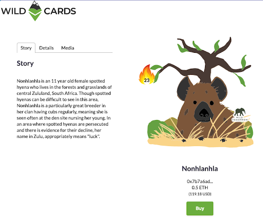
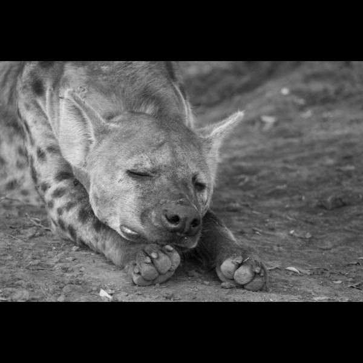

We’re excited today to be telling you more about our very first partnership, launched in October last year, with the incredible Wild Tomorrow Fund!

As our partners say, "we want to ensure that the world that comes after us is a world in which a wild tomorrow is possible."

`youtube:https://www.youtube.com/embed/UCW_qAtXQyw`

Wild Tomorrow fund works throughout Southern Africa protecting threatened and endangered species and the habitats they call home. This includes ensuring that wildlife habitats are expanded and protected while existing reserves get the resources needed to keep their animals safe.

## Wild Tomorrow Fund Partnership

The partnership will see more funds being raised for Wild Tomorrow Fund conservation efforts through the wildcards platform. The [spotted hyena project](https://www.wildtomorrowfund.org/blog/2018/7/31/launch-of-the-mun-ya-wana-conservancy-spotted-hyena-project) is an example of one amazing project currently on the go. Head over to wildcards.world and become the guardian of Nonhlanhla today to help support Wild Tomorrow Fund in their amazing work!

## About Wildcards

Wildcards is a fun and engaging platform raising funds for animal conservations around the globe. Users can become the guardian of various cool animals, earn badges and rewards, rank on leaderboards, and help support conservation on a global scale. The platform also educates the public about the vast number of conservations working worldwide to ensure that the precious animals we have today will flourish tomorrow.

Follow us on Instagram: [@wildcards_world](https://www.instagram.com/wildcards_world)

Follow us on Twitter: [@wildcards_world](https://twitter.com/wildcards_world)

Follow us on Facebook: [@wildcards.conservation](https://www.facebook.com/wildcards.conservation)

Join us on [Discord](https://discord.gg/Wemmn63)

As always, stay cool, stay safe and stay tuned

Team Wildcards
