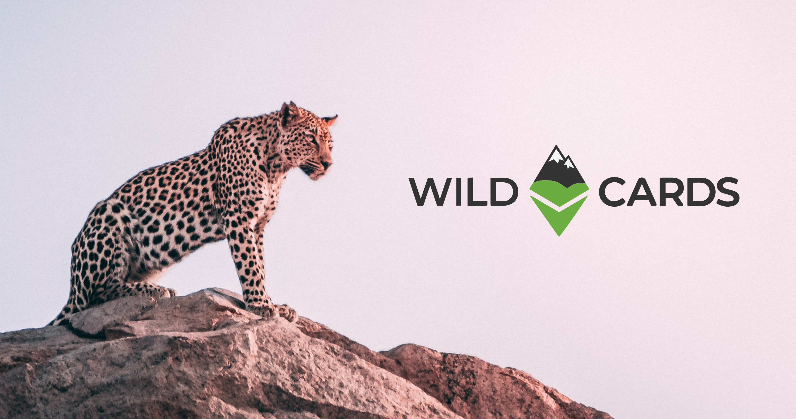

# Wildcards: an unprecedented means of funding conservation

**_Tech nerds and conservation agencies unite_**

As the economic devastation of Covid-19 cripples critical conservation projects globally, their funding sources dry up. Fundraising events and ecotourism are on hold; traditional streams of funding are strapped for cash; private contributors have donor fatigue and organisations everywhere are anxious about what the future holds. As food becomes scarce and poverty rises, the adverse effects on wildlife increases. Hunting for bushmeat and poaching for exotic animal parts are intensifying. How long will we feel the effects of Covid-19?

Wildcards is an unconventional strategy that is able to harness funding for conservation while simultaneously providing entertainment and dare we say, fun.

Gamification and conservation are an unusual marriage, but with cryptocurrency acting as their glue, they attract new audiences and offer a new way of funding conservation agencies who are making a real impact around the world.

**Wildcards 101**

**Wildcards + conservation partners: what’s in it for you?**

Together, Wildcards and conservation partners are a win-win. Being a Wildcards conservation partner is free and carries no risk and no extra demands for the funding recipient. It gives conservation agencies and their cause exposure and allows them to tap into a unique, emerging global network of funders who operate within the cryptocurrency community.

Funders are typically from a tech background and are keen to contribute in a meaningful way to conservation. Wildcards are planning to tap into funders from the lucrative gaming industry next. Existing Wildcards conservation partners who are already benefiting from the Wildcards platform include[ Senda Verde](http://www.sendaverde.org/),[ Wild Tomorrow Fund](https://www.wildtomorrowfund.org/),[ Darwin Animal Doctors](http://darwinanimaldoctors.org/),[ Great Whale Conservancy](https://www.greatwhaleconservancy.org/),[ Biodiversity and Development Institute](http://thebdi.org/),[ Pangolin.Africa](https://www.pangolin.africa/),[ Lemur Conservation Network](https://www.lemurconservationnetwork.org/),[ Shark Spotters](https://sharkspotters.org.za/), and[ Care for Wild Rhino Sanctuary](https://www.careforwild.co.za/).

**What are Wildcards and how does it work?**

You publicly buy a virtual animal ‘wildcard’ online, which then makes you the guardian of that particular animal. Each wildcard is accompanied by that animal’s history and contains interesting facts about the animal. Each animal represents a conservation agency which helps to protect the actual individual animal or its species. When you buy a wildcard, you must also set the price you are willing to sell it for.

Every month, the guardian of a wildcard gives a specified portion of the price they are willing to sell that wildcard for, to that animal’s representative conservation agency.

I.e. You buy a wildcard, set its selling price to US$100, then because that wildcard has a 20% monthly donation you give US$20 a month to the conservation agency that animal represents.

So at any point someone can buy the wildcard from you, if they are willing to pay the selling price you specified, because wildcards are always for sale. When someone buys the wildcard from you they must set a selling price. They, the new guardian of the wildcard, are then responsible for giving the new monthly donation. And so, the cycle continues the generation of funds.

**Why buy wildcards: Gamified giving meets conservation commission**

Each time a card is sold, revenue is collected by the outgoing guardian, a minimum of 5% of this revenue goes to running the Wildcards platform. Wildcard guardians get to support their favourite conservation agencies who are making real-world impacts. Wildcards also keeps its audience up to date with the work of its conservation partners and posts notifications of changes in the guardianship of a wildcard via social media. The awarding of badges, the celebration of giving streaks, and the guardianship-giving leaderboard is transparent and public, and acknowledges guardians for their giving.

**The Beauty of Blockchain: Transactions are transparent, traceable in real-time, and there are no international banking fees**

Transparency is at the core of Wildcards. At any point in time, anyone can instantly verify the movements of funds. Moreover, no one can cheat the mechanism and the flow of funds, because Wildcards uses blockchain technology. The beauty of blockchain is that it’s a decentralised database that’s distributed and duplicated on multiple computers at the same time, allowing interaction without the need for involving counterparties such as banks.

As new records — known as “blocks” — are added, the blockchain grows. Each block contains links to the preceding blocks and has timestamps, thereby forming a chain. As funds are in the form of Ether, a cryptocurrency, there are no international transaction fees when people from abroad donate to your agency. 1 Ether is currently worth US$ 243,60. However, for now, converting Eth to your local currency will incur a small fee. This fee will likely drop in the future as more global commerce moves on to the blockchain and the technology improves. There are also plans to allow the use of stable cryptocurrencies whose coin value is fixed at 1 US$.

**Crypto, gaming, giving: a new era for conservation funding**

Well-known conservation agencies such as WWF already have extensive systems, platforms and long-standing audiences, but smaller conservation agencies and funds tend to fall through the gaps. They may not have access to the same reputation and legacy that prominent conservation agencies do or have the technical resources required to effectively raise funds in a digital age. However, the work they do is still hugely valued and critical to conserving wildlife. Instead of contributing to one, big, global fund, Wildcards is able to split its global giving to many small funds that each make a big difference on regional and local levels. Wildcards make sure that smaller conservations aren’t left behind while globalisation and new technologies continue to change the world to favour large organisations.

With the world all but turned on its head and looking for fresh ways to reinvent itself, Wildcards has the potential to herald a new era of funding which is mutually beneficial and offers value along with visibility.

Follow Wildcards on twitter: [@wildcards_world](https://twitter.com/wildcards_world)

Follow Wildcards on Facebook: [@wildcardscrypto](https://www.facebook.com/wildcardscrypto)

Join us on Telegram: [Telegram](https://t.me/wildcardsworld)
